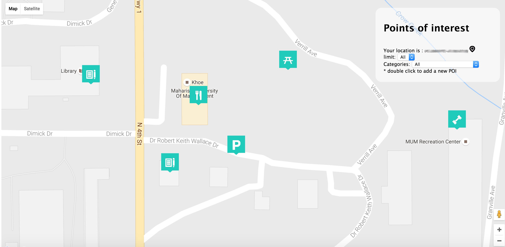

Bookmark Nearby Locations
-------
each location has a name and a cateogry
This assigment to create yelp simple clone, using expressjs, mongodb, and google maps api

see example below:
PS: **Please modify config_developement.json and use your own Google maps key**

##License
###Imporant
uses [map-icons library](https://github.com/scottdejonge/map-icons)
thus the following licenses applies
###Font License

Applies to font files inside: `dist` directory.

Map Icons licensed under [SIL OFL 1.1](http://scripts.sil.org/OFL)

###Code License

Applies to code inside: `dist` directory.

Code licensed under [MIT License](http://opensource.org/licenses/mit-license.html)

###Documentation License

Applies to files not a part of other licenses.

Documentation licensed under [CC BY 3.0](http://creativecommons.org/licenses/by/3.0/)

